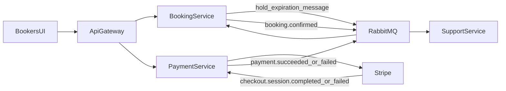

# Booking Event Flow

## State Machine

- `SEATS_HELD` -> `SNACKS_SELECTED` -> `PAYMENT_PENDING` -> `CONFIRMED`
- Failure paths:
  - `PAYMENT_PENDING` -> `FAILED`
  - `SEATS_HELD | SNACKS_SELECTED | PAYMENT_PENDING` -> `EXPIRED`
  - `SEATS_HELD | SNACKS_SELECTED | PAYMENT_PENDING` -> `CANCELLED`

## Non-Negotiable Invariants

- Booking is confirmed only after Stripe webhook success.
- Duplicate webhooks and duplicate queue deliveries are safe.
- Seat release on failure/expiration/cancellation broadcasts realtime availability.
